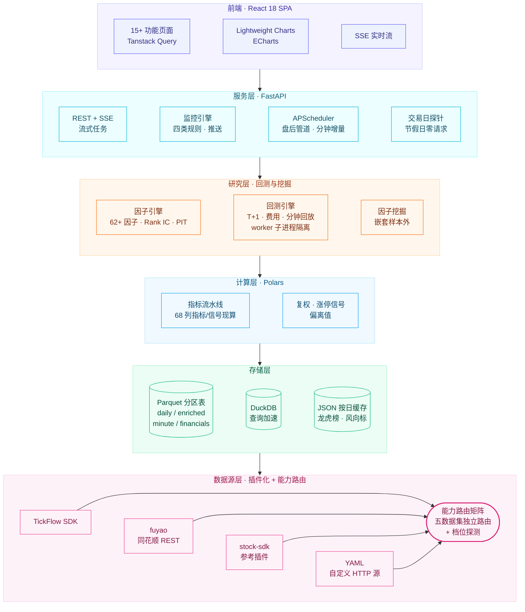

<div align="center">

# 📈 A股智能量化工作台

[](https://github.com/shy3130/tick-stock-panel)

**自托管、零运维的 A 股「选股 + 监控 + 回测」量化工作台**

**多数据源能力路由 · 分钟级策略执行 · 全时段异动监控 · AI 辅助研究**

[](./LICENSE)
[](https://www.python.org/)
[](https://react.dev/)
[](https://tickflow.org/auth/register?ref=V3KDKGXPEA)
[](./Dockerfile)
[](https://github.com/shy3130/tick-stock-panel/stargazers)

</div>

<div align="center">

**[快速开始](#-快速开始)** · **[核心功能](#-核心功能)** · **[技术架构](#️-技术架构)** · **[配置](#️-配置)** · **[完整文档](#-完整文档)**

</div>

---

**本项目个人开源，数据源插件化，可任意接入第三方数据源。仅供学习研究使用，严禁商业用途。**

> ⚠️ 小白请绕路，本开源项目谨作为本地量化提供解决思路Demo，不作为投资软件或者看盘软件。
>
> **明确不做**:不对标同花顺 / 通达信,不内置「AI 荐股 / 涨停预测」。

有问题可以邮件415333856@qq.com。

觉得有用可以点个 Star

---

## ✨ 核心功能

| 模块             | 一句话                                                                 | 详见                              |
| :--------------- | :--------------------------------------------------------------------- | :-------------------------------- |
| 🔀 **能力路由**   | 五大数据集(daily/adj/realtime/minute/financial)按源能力独立路由,任选组合 | [custom-data-source.md](./docs/custom-data-source.md) |
| 🔍 **选股引擎**   | 18 个内置策略 + 分钟策略 + 自定义信号 + AI 生成,Polars 毫秒级扫全 A 股 | [strategy.md](./docs/strategy.md) |
| 📊 **指标流水线** | MA/EMA/MACD/RSI/KDJ/布林/量比等 68 列指标与信号,一次扫表落盘 enriched Parquet    | [features.md](./docs/features.md) |
| 🧪 **回测研究**   | 因子/策略/分钟回测 + 财务快照因子(点时口径),T+1/费用/滑点约束,结果可导出 | [features.md](./docs/features.md) |
| ⛏️ **因子挖掘**   | 嵌套样本外搜索多因子排名组合,与自有策略对照,候选库显式发布、永不自动上线 | [mining.md](./docs/mining.md) |
| 🌡️ **市场环境**   | 情绪周期 6 阶段(连板梯队驱动)+ 概念/行业主线排名,与 5 档环境分并存    | [market-phase.md](./docs/market-phase.md) |
| 🚨 **异动监控**   | 竞价/盘中/偏移三类异动一页覆盖:同花顺风向标 + 当日信号聚合 + 交易所偏离值口径 | — |
| 📡 **监控中心**   | 四类监控(策略/个股信号/价格/异动),多条件 AND/OR + 语音播报 + 飞书推送  | [features.md](./docs/features.md) |
| 📈 **个股分析**   | 9 类关键价位 + AI 四维分析(技术/基本面/财务/消息面)                    | [features.md](./docs/features.md) |
| 🏆 **连板梯队**   | 连板层级统计 + 概念涨幅轮动 + 盘后 AI 复盘(龙虎榜/盘前风向标注入) + 炸板/翘板预警 | [features.md](./docs/features.md) |
| 🧰 **数据扩展**   | 数据源插件化(TickFlow/fuyao/stock-sdk + YAML 自定义源),扩展字段配成一级页面同台分析 | [custom-data-source.md](./docs/custom-data-source.md) |

<details>
<summary><b>📦 主要页面与功能</b></summary>

**📊 行情总览**
- **看板** Dashboard — 市场情绪评分 + 涨跌/成交额榜单 + 概念/行业领涨领跌(点击板块直达成分股,领涨股带涨跌幅) + 大盘异动事件流,一日全貌
- **自选** Watchlist — 自选股池,多分组管理(M:N),表格/卡片双视图,换手/量比/RSI 等实时指标,按档位分流实时刷新
- **指数** Indices — 沪深指数浏览与同步

**🔍 选股与回测**
- **策略** Screener — Polars 毫秒级扫描全 A 股,日线/分钟策略统一单池,按策略声明周期自动路由执行
- **回测** Backtest — 四种研究视图:
  - **因子回测** — IC/IR、分层收益、多空组合,62+ 因子目录先筛掉无效指标
  - **策略回测** — 净值曲线、回撤、夏普、胜率,T+1/手续费/滑点/止损,SSE 流式进度
  - **分钟策略回测** — 逐交易日回放信号、分钟收盘入场,分钟级成交明细
  - **验证** — 参数敏感性与滚动样本外
  - 研究闭环:结果导出 CSV(概要/净值/交易明细/分标的统计) → 保存候选 → **一键载入复测**
- **挖掘** Mining — 嵌套样本外因子与策略挖掘:训练区间因子方向重估 + 相关性去重 + 多因子排名组合搜索,自有策略作对照轨;候选入库,显式确认后才发布,永不自动上线

**📈 个股与板块分析**
- **个股分析** Stock Analysis (Beta) — 日K + 9 类关键价位 + AI 四维分析(技术/基本面/财务/消息面)
- **财务分析** Financials — 利润表/资负表/现金流/关键指标(多源并集合并,fuyao 财务四表适配) + AI 解读
- **概念分析 / 行业分析** — ths 维度涨幅轮动矩阵 + 领涨/领跌主线 + 个股穿透
- **市场环境** Regime — 情绪周期 6 阶段(冰点/启动/主升/高潮/退潮/修复,连板梯队驱动,EMA 平滑 + 2 日确认)+ 概念/行业主线排名,与 5 档环境分并存
- **连板梯队** Limit Up Ladder — 连板层级统计 + 概念/行业分布 + 封单监控(可切换连跌梯队)

**🔔 监控与复盘**
- **监控中心** Monitor — 策略/个股信号/价格/异动四类规则,支持自选分组作用域,盘中实时弹窗 + 语音播报(播报个股名称与信号) + 触发记录持久化
- **异动监控** Abnormal Moves — 按交易时间线三 tab:
  - **竞价异动** — 同花顺盘前风向标(含当日/次日真实收益对照、追高风险标记)+ 全市场竞价扫描(待采集任务)
  - **盘中异动** — 涨停/炸板/翘板/跌停/新高/新低/放量当日信号聚合,零新增采集
  - **偏移异动** — 交易所异动偏离值口径(主板 3 日 ±20%、创业板/科创板 ±30%、北交所 ±40%;10 日 +100%/−50%、30 日 +200%/−70%),实时接近度
- **复盘** Review (Beta) — 盘后 AI 自动生成市场复盘,注入龙虎榜资金动向与盘前风向标对照;可定时执行、推送飞书、下载 Markdown

**🗄️ 数据与扩展**
- **数据** Data — 本地数据画像与同步状态(维表/日K/除权/Enriched/指数/ETF/分钟K/财务),盘后管道与历史扩展
- **扩展分析** (动态菜单) — 把任意第三方/扩展数据字段配成一级菜单,与内置数据同台分析
- **设置** Settings — 数据源与能力检测(能力路由矩阵、档位徽章)、AI 接口、实时监控、扩展页面、信号库、菜单与系统设置

</details>

---

## 📸 界面预览

<table>
  <tr>
    <td width="50%" align="center"><b>看板 Dashboard</b></td>
    <td width="50%" align="center"><b>策略 Screener</b></td>
  </tr>
  <tr>
    <td width="50%"></td>
    <td width="50%"></td>
  </tr>
  <tr>
    <td width="50%" align="center"><b>回测 Backtest</b></td>
    <td width="50%" align="center"><b>挖掘 Mining</b></td>
  </tr>
  <tr>
    <td width="50%"></td>
    <td width="50%"></td>
  </tr>
  <tr>
    <td width="50%" align="center"><b>监控中心 Monitor</b></td>
    <td width="50%" align="center"><b>连板梯队 Limit Ladder</b></td>
  </tr>
  <tr>
    <td width="50%"></td>
    <td width="50%"></td>
  </tr>
  <tr>
    <td width="50%" align="center"><b>概念分析 Concept</b></td>
    <td width="50%" align="center"><b>自选 Watchlist</b></td>
  </tr>
  <tr>
    <td width="50%"></td>
    <td width="50%"></td>
  </tr>
</table>

<div align="center">

### 📸 [查看更多界面截图 »](./screenshots/README.md)

</div>

---

## 🏗️ 技术架构

### 分层总览



### 关键机制

| 机制 | 说明 |
| :--- | :--- |
| **能力路由矩阵** | 五大数据集按源声明能力独立路由:TICKFLOW 档位探测(None/Free/Starter/Pro/Expert)+ 插件源能力声明,fail-closed(声明 `pct_unit` 未声明即拒)。同一数据集可随时换源,指标与回测口径不变 |
| **交易日探针** | fuyao 交易日历(确定性,含调休)→ tickflow 全市场行情时间戳探针(OR 语义)→ 工作日兜底;节假日自动停掉实时轮询与分钟增量,零无效请求 |
| **财务多源合并** | 按 `(symbol, period_end)` 报告期累积,多源取并集、逐列按公告日取最新(PIT);公告前一律空值,绝不填 0 |
| **非路由数据集直连** | 龙虎榜/盘前风向标/交易日历等 fuyao 专有能力不进路由矩阵,由独立服务直连消费——按日 JSON 缓存(历史不可变)、交易日回退、四态降级 |
| **回测执行隔离** | 回测在 spawn worker 子进程运行,持久 run ID,刷新/切页重连不丢任务;子进程结果消息经锁保护回传 |
| **分层缓存** | enriched 读取时现算指标(存储仅 15 列基础数据,现算 68 列指标与信号)+ 进程内快照缓存;扩展字段按日分区快照,页面即配即用 |

### 技术栈

| 层           | 选型                                                                                              |
| :----------- | :------------------------------------------------------------------------------------------------ |
| **后端**     | FastAPI · Pydantic v2 · APScheduler · sse-starlette                                               |
| **数据**     | Polars(计算)· DuckDB(查询)· Parquet(存储)                                                         |
| **回测**     | 自研仓位模拟引擎(T+1/费用/滑点/分钟回放)· vectorbt(部分路径)                                       |
| **数据源**   | [TickFlow](https://tickflow.org/auth/register?ref=V3KDKGXPEA) 官方 SDK · fuyao(同花顺 REST) · 插件化扩展(stock-sdk 示例插件 · YAML 自定义源) |
| **AI**(可选) | OpenAI 兼容接口(DeepSeek / 通义 / Ollama 等)                                                      |
| **前端**     | React 18 · Vite · TypeScript · Tailwind · Tanstack Query · Lightweight Charts · ECharts · dnd-kit |
| **部署**     | Docker 两阶段构建,前端 dist 拷进后端镜像,**单容器**                                               |

---

## 🚀 快速开始

> 前置依赖:Python ≥ 3.11 · Node ≥ 20 · [`uv`](https://docs.astral.sh/uv/) · `pnpm`(`npm i -g pnpm`)

### 方式 A:Dev 模式(二次开发推荐)

```bash
cp .env.example .env       # 按需填 TICKFLOW_API_KEY(留空 = None 模式)
./dev.sh                   # Windows: .\dev.ps1
```

自动检查 / 下载依赖、释放端口、同时起前后端。后端 → <http://localhost:3018> · 前端 → <http://localhost:3011>。

### 方式 B:Docker(部署最省心)

```bash
cp .env.example .env
docker compose up --build
# 打开 http://localhost:3018
```

Docker 镜像内置固定版本的 **Codex CLI**，Compose 会将主机 `${HOME}/.codex` 只读挂载到容器，因此主机需先完成 Codex 登录。若主机 Codex 使用 loopback local-access provider，容器会保留实际端口并自动将主机名映射为 `host.docker.internal`。需要覆盖镜像内版本时可设置构建参数：

```bash
CODEX_CLI_VERSION=0.144.3 docker compose up --build
```

> **Windows 用户注意**：纯 PowerShell / CMD 下 `HOME` 环境变量通常未设置，会导致挂载路径解析失败、容器读不到 Codex 登录态。请在 `.env` 中显式指定主机 Codex 目录：
> ```bash
> # PowerShell 示例(实际路径以本机为准)
> echo "CODEX_HOME_HOST=C:\Users\你的用户名\.codex" >> .env
> ```

> Codex CLI 模式允许 TickFlow 容器读取本机 Codex 登录凭据，仅应在受信任的本机环境启用。凭据目录以只读方式挂载，不会写入镜像。

镜像已内置 **stock-sdk** 数据源插件(Node 运行时 + 依赖),开箱即用。

> 📖 Docker 进阶、GitHub Actions 自构建、老 CPU 兼容、访问密码设置等见 [docs/deployment.md](./docs/deployment.md)。

### 跑起来后的第一次使用

1. **设置 → 凭据与能力** → 点 **重新检测**,确认档位标签与能力路由矩阵
2. **设置** → **立即跑盘后管道**:拉日 K + 计算 enriched 表(None / Free 走 free-api,当日数据盘后 1-2 小时可用)
3. **自选**页加标的 → **选股**页点策略卡片扫描 / 配自定义信号
4. **回测**页选策略 + 区间 → 看净值 / 夏普 / 交易明细(SSE 实时进度),结果可导出 CSV、存候选一键复测
5. **监控中心**配规则,盘中实时弹窗 + 持久化记录;**异动监控**覆盖竞价/盘中/偏移全时段

---

## ⚙️ 配置

所有配置从根目录 `.env` 读取(复制 `.env.example` 开始),也可在面板 **设置** 页修改。最常用的三项:

```ini
TICKFLOW_API_KEY=              # 留空 = None 模式(历史日K免费);填 Key 解锁更多
AI_API_KEY=                    # 留空 = 关闭 AI;填 Key 启用策略生成
PORT=3018                      # 服务端口
```

> 📖 完整配置项(数据源档位、AI、服务、密码、老 CPU 兼容)见 [docs/configuration.md](./docs/configuration.md)。

---

## 🗺️ 路线图

| Phase  | 内容                                                               | 状态 |
| :----- | :----------------------------------------------------------------- | :--- |
| 0-1    | 仓库骨架 · FastAPI 壳 · 能力探测 · K 线同步与分析页                | ✅    |
| 2-3    | Polars enriched 流水线 · Screener · 回测引擎(T+1/手续费/止损)      | ✅    |
| 4-5    | 监控引擎 · 四类监控规则 · 实时 SSE 推送 · 持久化记录               | ✅    |
| 6      | 个股分析(专用日 K + 9 类关键价位 + AI 四维分析)                    | ✅    |
| **v0.2** | 因子挖掘全链路 · 市场阶段与主线识别 · 异动监控 · 数据源插件化     | ✅    |
| **v0.3** | 能力路由矩阵 · fuyao 数据源(财务/龙虎榜/风向标) · 分钟策略与回测 · 交易日探针 · 全时段异动中心 · 回测导出与候选复测 | ✅ |
| **v2** | Webhook 推送· 板块异动 · 早晚报 · 全市场竞价采集 · 更多扩展        | 🚧    |

---

## 📚 完整文档

| 文档                                                                                               | 内容                                                                 |
| :------------------------------------------------------------------------------------------------- | :------------------------------------------------------------------- |
| [docs/deployment.md](./docs/deployment.md)                                                         | 部署方式(Dev / Docker / GH Actions)、老 CPU 兼容、更新代码、访问密码 |
| [docs/configuration.md](./docs/configuration.md)                                                   | 所有 `.env` 配置项详解(数据源、AI、服务、密码、数据目录)             |
| [docs/features.md](./docs/features.md)                                                             | 各功能模块详细说明(选股/指标/回测/监控/个股分析/数据扩展)            |
| [docs/custom-data-source.md](./docs/custom-data-source.md)                                         | 自定义数据源接入、能力路由契约、YAML 配置与 mock 联调示例            |
| [docs/strategy.md](./docs/strategy.md)                                                             | 策略体系(18 内置策略 + 三种扩展方式 + 文件结构)                      |
| [docs/mining.md](./docs/mining.md)                                                                 | 因子与策略挖掘口径、防泄漏、任务隔离和发布边界                       |
| [docs/market-phase.md](./docs/market-phase.md)                                                     | 市场情绪周期 6 阶段与概念/行业主线识别的口径与设计                   |
| [docs/plugin-development.md](./docs/plugin-development.md)                                         | 数据源插件开发规范(以 stock-sdk / fuyao 为参考实现)                 |
| [docs/secondary-development.md](./docs/secondary-development.md)                                   | 代码二次开发、前端插槽、后端策略接口与 AI 开发模板                   |
| [backend/app/strategy/prompts/strategy-guide.md](./backend/app/strategy/prompts/strategy-guide.md) | 策略开发完整规范(AI 生成与手写)                                      |

fork同时请点个star哦,欢迎 Issue 和 PR。

---

## 💬 交流群

欢迎加入交流群,讨论交流。


---

## ⚠️ 免责声明

本项目仅供**学习与量化研究**,**不构成任何投资建议**。回测结果不代表未来收益。A 股有风险,入市需谨慎。数据准确性以数据源官方为准。

## 📄 License

[MIT](./LICENSE) © tick-stock-panel contributors 

本项目依赖 [TickFlow](https://tickflow.org/auth/register?ref=V3KDKGXPEA) 提供数据服务,使用前请遵守其服务条款

数据源插件 [stock-sdk](https://stock-sdk.linkdiary.cn) 遵循其各自的 ISC 协议。

## 社区

本开源项目已链接并认可 [LINUX DO 社区](https://linux.do)。

本开源项目由 [智谱 GLM 大模型](https://open.bigmodel.cn/) 辅助构建,感谢 [智谱 AI 开放平台](https://open.bigmodel.cn/) 提供支持。
